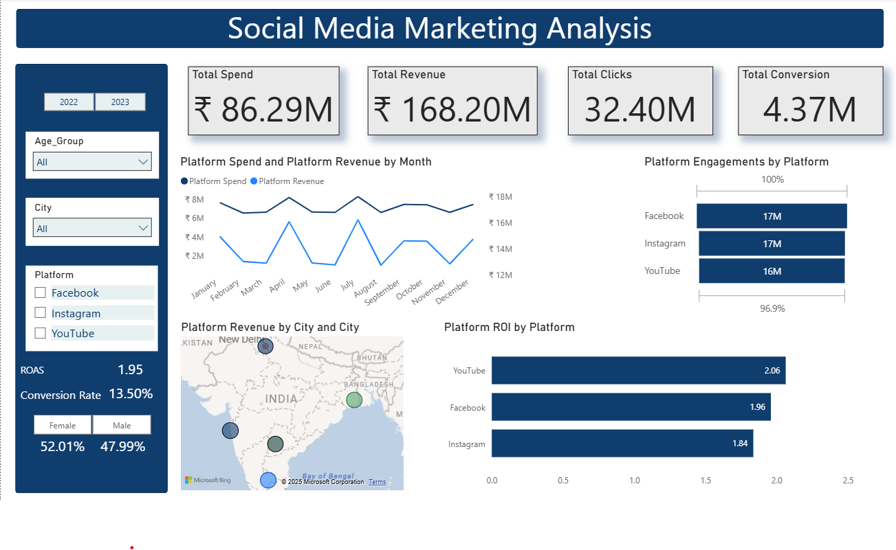

# Socia Media Marketing Analysis 📊

This Power BI dashboard analyzes ad performance across Facebook, Instagram, and YouTube using metrics like ROI, conversion rate, gender segmentation, and city-wise revenue.

## 📌 Objective
To help marketing teams evaluate influencer platform efficiency and optimize budget allocation across platforms and cities.

---

## 📊 Dashboard Highlights

- 🔹 ROI comparison across platforms
- 🔹 Monthly spend vs. revenue trends
- 🔹 Gender and city breakdown
- 🔹 Demographic engagement (clicks, conversions, impressions)

---

## 💡 Key Insights

- **YouTube** had the highest ROI (2.06)
- **Instagram** performed best for female users and younger audiences
- **Facebook** drove the highest reach
- **Kolkata** underperformed in ROI, while **Delhi & Bangalore** topped conversions

---

## 🧠 Recommendations

- Shift spend to Instagram & YouTube
- Reduce budget in low-ROI cities
- Focus on female audiences for Instagram

---

## 📁 Files Included

- `.pbix` dashboard file
- Screenshots of filtered dashboards
- Executive summary with annotations

---

## 📸 Preview

---

## 📂 Tools Used

- Power BI
- DAX for calculated measures
- CSV-based data model with relationships

---

## 📌 Status

✅ Completed and documented for portfolio  
📬 Feel free to fork or use this as a Power BI case study!

